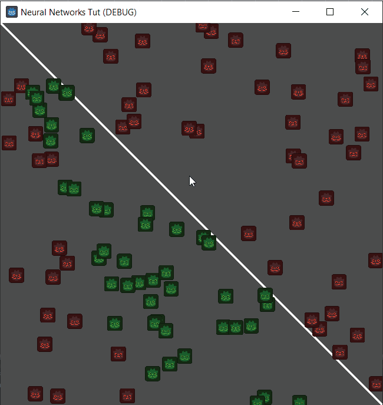

# Godot-Single-Perceptron-Neural-Network

Built with Godot.

A Single Perceptron Neural Network, on every click a new generation is run.
The AI is told to guess if the picture is above the line or under it. Green is for correct guesses and red are for wrong guesses.
Using supervised learning after every generation the "weight" of the perceptron is changed so it could make a better guess.

Project was made in 23/2/2024.
